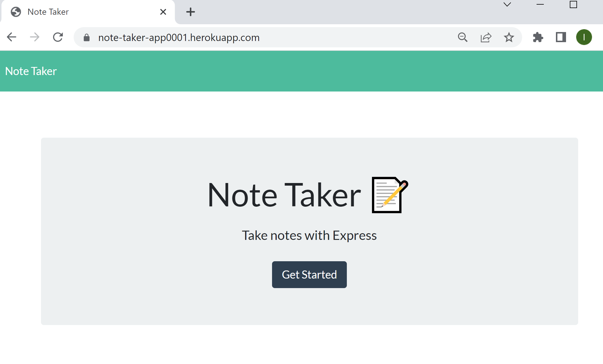
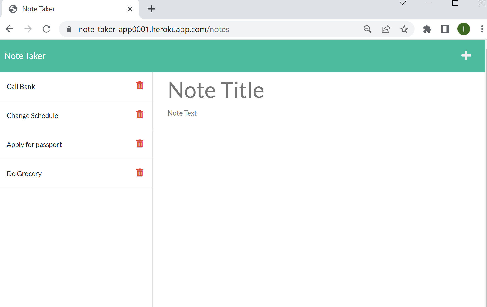

## Project Title
Note Taker

## Project Description
A note taking application that can be used to write and save notes. Using Express.js back end, the application will save and retrieve note data from a JSON file.

## Technologies
* Express.js
* JavaScript
* Node.js
* HTML
* CSS
* Deployed using Heroku

## Link to Deployed page:
https://note-taker-app0001.herokuapp.com/

## Screenshots

## License 
